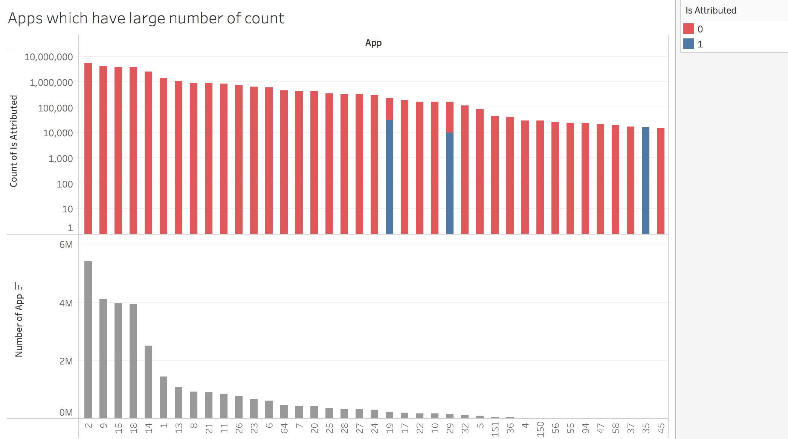
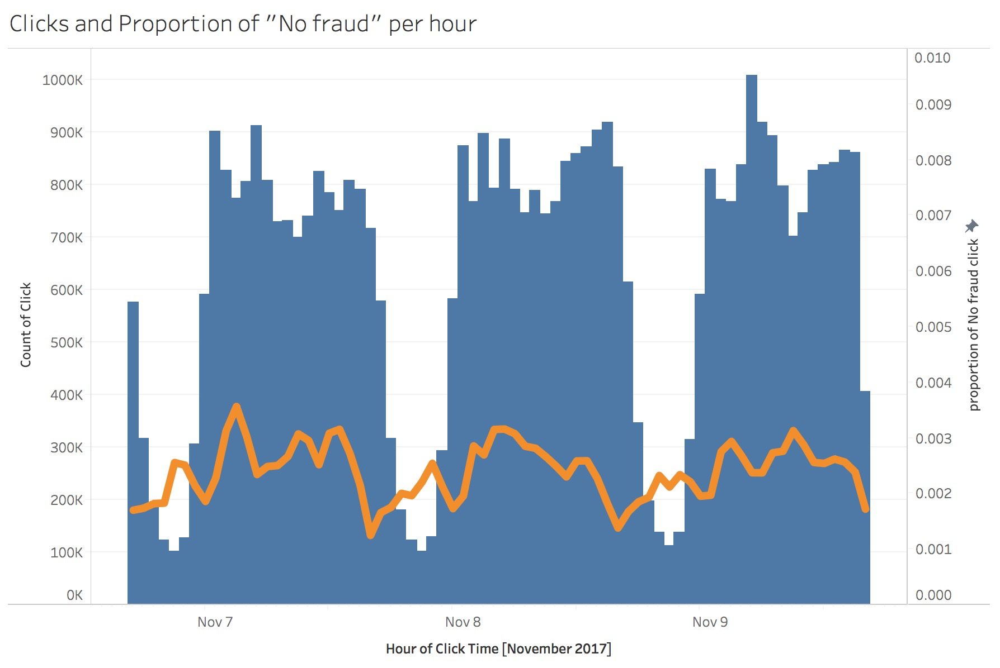

# ADS Project 5: AdTracking Fraud Detection

Term: Spring 2018

+ Team #4
+ Project title: AdTracking Fraud Detection-Detect fraudulent click traffic for mobile app ads-





**Team members**:
	+ Zhongxing Xue zx2221@columbia.edu
	+ Junkai Zhang jz2929@columbia.edu
	+ Xiaoxiao Guo xg2282@columbia.edu
	+ Sitong Chen sc4283@columbia.edu
	+ Wenshan Wang ww2468@columbia.edu

**Project summary**:
  + Click fraud occurs on the Internet in pay-per-click (PPC) online advertising. It occurs when a person, automated script or computer program imitates a legitimate user to click on ad. For companies that advertise online, click fraud can happen at an overwhelming volume, resulting in misleading click data and wasted money. According to TalkingData, 90% of clicks are potentially fraudulent.
  + In this project, we predict whether a user will download an app after clicking a mobile app ad. To do this prediction, we implemented XGBoost, random forest, decision tree, naive bayesian and lightgbm model on our dataset. Also, to weaken the influence of imbalanced data, we tried smote algorithm to balance the data.

**Business insight**:
  + Through this project, we hope to flag IP addresses, os version and devices who produce lots of clicks, but never end up installing apps. Our final goal is to help app developers detecting and avoiding click fraud to save cost and obtain an accurate market feedback.

**Contribution statement**: ([Contribution Statement](doc/a_note_on_contributions.md))
+ Zhongxing Xue(zx2221): Implemented naive bayesian model, conducted EDA, conducted data processing, and used tableau to generate plots.

+ Junkai Zhang (jz2929): Implemented XGBoost model, wrote main files and summarized functions and models.

+ Xiaoxiao Guo (xg2282): Implemented random forest and decision tree, conducted EDA.

+ Sitong Chen (sc4283): Implemented lightGBM model, made ppt and wrote readme file.

+ Wenshan Wang (ww2468): Implemented XGBoost model, wrote ppt and made presentation.

**Reference**:
+ https://www.kaggle.com/swamysm/fraud-detection-by-random-forest-dt-and-svm
+ https://www.kaggle.com/pranav84/talkingdata-eda-to-model-evaluation-lb-0-9683

Following [suggestions](http://nicercode.github.io/blog/2013-04-05-projects/) by [RICH FITZJOHN](http://nicercode.github.io/about/#Team) (@richfitz). This folder is orgarnized as follows.

```
proj/
????????? lib/
????????? data/
????????? doc/
????????? figs/
????????? output/
```

Please see each subfolder for a README file.
