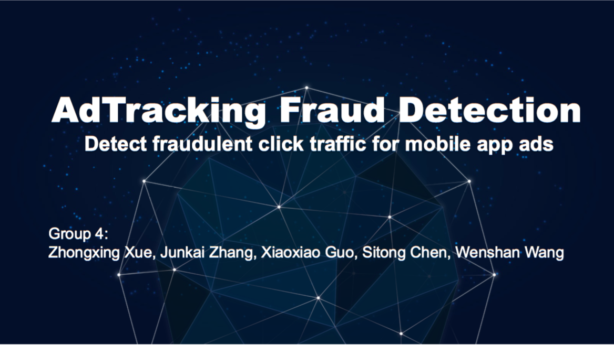
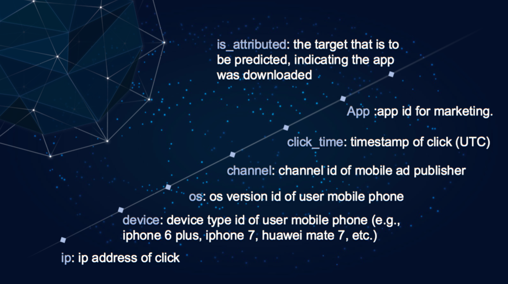

# ADS Project 5: AdTracking Fraud Detection

Term: Spring 2018

+ Team #4
+ Project title: AdTracking Fraud Detection-Detect fraudulent click traffic for mobile app ads-




+ Team members
	+ Zhongxing Xue zx2221@columbia.edu
	+ Junkai Zhang jz2929@columbia.edu
	+ Xiaoxiao Guo xg2282@columbia.edu
	+ Sitong Chen sc4283@columbia.edu
	+ Wenshan Wang ww2468@columbia.edu

+ Project summary:
+ Click fraud occurs on the Internet in pay-per-click (PPC) online advertising. It occurs when a person, automated script or computer program imitates a legitimate user to click on ad. For companies that advertise online, click fraud can happen at an overwhelming volume, resulting in misleading click data and wasted money. According to TalkingData, 90% of clicks are potentially fraudulent.
+ In this project, we implemented models to predict whether a user will download an app after clicking a mobile app ad. By doing this, we hope to flag IP addresses who produce lots of clicks, but never end up installing apps. Our final goal is to help app developers detecting and avoiding click fraud to save cost and obtain an accurate market feedback.

**Contribution statement**: ([Contribution Statement](doc/a_note_on_contributions.md)) All team members contributed equally in all stages of this project. All team members approve our work presented in this GitHub repository including this contributions statement. 

Following [suggestions](http://nicercode.github.io/blog/2013-04-05-projects/) by [RICH FITZJOHN](http://nicercode.github.io/about/#Team) (@richfitz). This folder is orgarnized as follows.

```
proj/
????????? lib/
????????? data/
????????? doc/
????????? figs/
????????? output/
```

Please see each subfolder for a README file.
